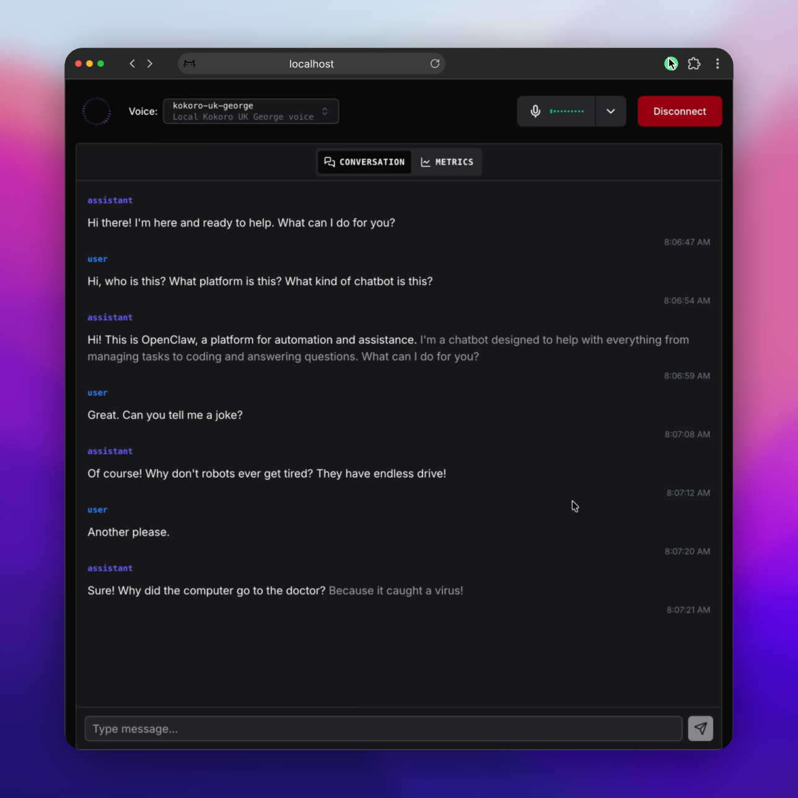

# Talky

Voice interface for AI. Talk to OpenClaw, Moltis or Pi. Or use MCP to talk to Claude.

<a href="screenshots/main.png" target="_blank">
  
</a>

## Quick Start

**Requirements**: Python 3.12 or 3.13, [uv](https://docs.astral.sh/uv/), Homebrew

```bash
brew install portaudio                # required for local audio (talky say)
uv tool install --editable .
talky openclaw                    # Talk to OpenClaw
talky moltis                      # Talk to Moltis  
talky pi                          # Talk to Pi
talky say "Hello world"           # Test voice output
```

## Usage

**Talk to AI**
- `talky openclaw` - OpenClaw assistant
- `talky moltis` - Moltis assistant  
- `talky pi` - Pi coding assistant
- Opens browser at `localhost:7860/client` for voice chat

**Change Voice**
- `talky moltis -v local-uk-george` - Use different voice
- `talky openclaw -v cloud-dude` - Cloud voice
- `talky say "test" -v google-puck` - Test specific voice

**List Options**
- `talky ls` - See all available voices and profiles

**MCP Server** (for Claude Desktop/Claude Code)
- `talky mcp` - Voice integration for Claude
- `talky mcp -v cloud-dude` - Use specific voice

**Setup**
- `talky config` - Create config files
- Add API keys to `~/.talky/credentials/` (one JSON file per provider)

> **Note:** The default voice profile uses local providers (kokoro TTS + whisper STT).
> These require `brew install portaudio` and will download ML models on first use.
> To avoid this, set a cloud voice profile in `~/.talky/settings.yaml` before running.

**Debug Logging**
```bash
TALKY_LOG_LEVEL=ERROR talky openclaw  # Errors only (recommended)
TALKY_LOG_LEVEL=WARNING talky moltis     # Warnings and errors
TALKY_LOG_LEVEL=INFO talky pi              # Verbose mode
TALKY_LOG_LEVEL=DEBUG talky openclaw      # Full debug

# Or use command line arguments (profile first!)
talky openclaw --log-level ERROR
talky moltis --log-level DEBUG
```

**Example API Keys**
```bash
# Deepgram (speech-to-text)
echo '{"api_key":"your-key"}' > ~/.talky/credentials/deepgram.json

# Google (text-to-speech)  
echo '{"credentials":"your-credentials"}' > ~/.talky/credentials/google.json
```

See [CLAUDE.md](CLAUDE.md) for dev details.
