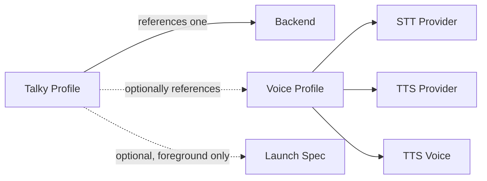
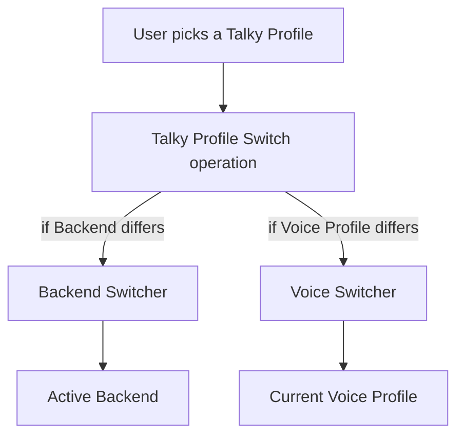
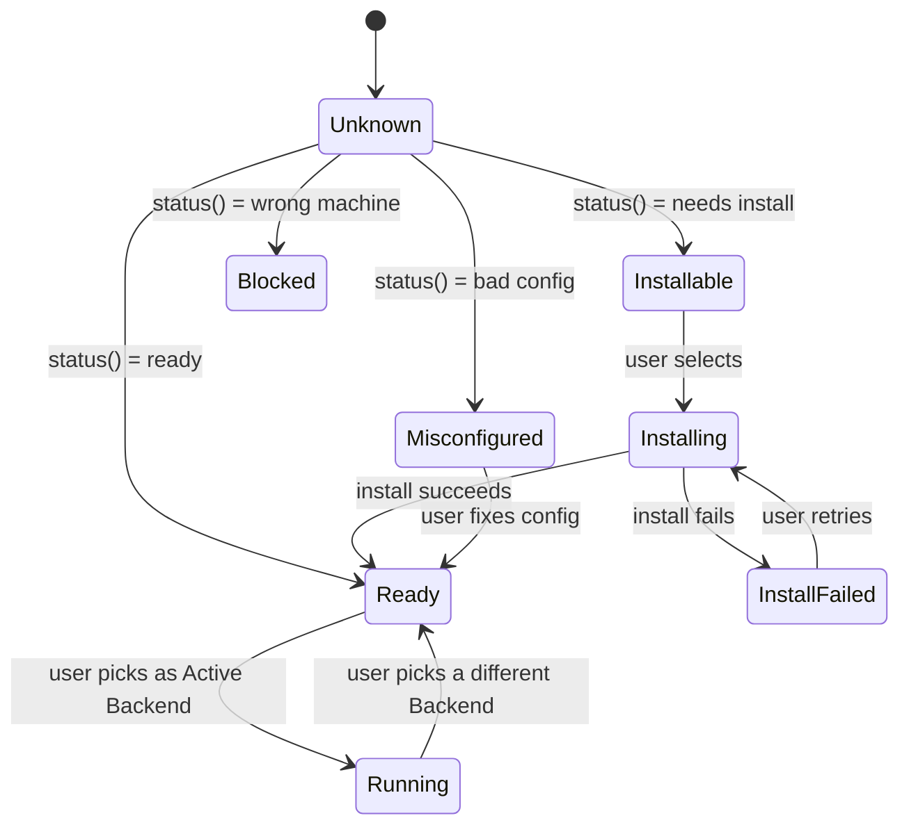

# Ubiquitous Language — talky

Living document. Workshopped, not declared. Decisions below are anchored in conversation; open questions at the bottom.

Three cleavages drive the vocabulary:

1. **Configuration vs. runtime.** Config is the *menu* of recipes in YAML. Runtime is the *live wiring* in the daemon. Most muddled names failed this distinction.
2. **Single-user, one conversation at a time.** No multi-tenant vocabulary. One daemon, one browser, one Active Backend at a time.
3. **Graceful degradation.** Talky doesn't hold all integrations to the same interactivity standard. The transport a consumer supports determines the features it gets. Vocabulary surfaces *which* transport and *which* limitations — never papers over them.

When framework terms leak in, qualify them: **Pipecat LLM Switcher**, **Pipecat Frame**, etc. Our nouns stay our own.

---

## Configuration (the menu — YAML entries)

| Term | Definition | Aliases to avoid |
| --- | --- | --- |
| **Talky Profile** | A named recipe in `talky-profiles.yaml` joining one Backend with, optionally, one Voice Profile and one Launch Spec. The user-selectable top-level unit (`talky openclaw`). | profile (bare), session profile, profile_map |
| **Voice Profile** | A named recipe in `voice-profiles.yaml` pairing one STT Provider + one TTS Provider + one TTS Voice. | voice preset, voice config |
| **Backend** | A named recipe in `llm-backends.yaml` (file name kept for now) pinning one Backend Adapter import path plus its config. Not all Backends are LLMs. | LLM backend, llm_backend, agent binding |
| **Backend Adapter** | The Pipecat-compatible adapter that connects a Backend's wire protocol into the pipeline. In config: a dotted import path string. At runtime: a live instance. Uniform across all Backend flavors. | service_class, LLMService, service |
| **STT Provider** / **TTS Provider** | A named entry in `voice-backends.yaml` pinning a Service Class for speech-to-text or text-to-speech. | voice backend |
| **TTS Voice** | A provider-specific voice ID. | voice id |
| **Launch Spec** | The `launcher:` block on a Talky Profile describing how to exec into an external agent CLI. Present only on foreground Talky Profiles. | launcher config |
| **Agent Mode** | `background` (daemon owns the Backend, browser is the UI) or `foreground` (daemon execs into an external agent CLI; the agent then dials back as a WebSocket Receiver). Determined by presence of a Launch Spec. | bare foreground/background — always pair with the noun |

### Composition

A Talky Profile *references* a Voice Profile — it doesn't contain STT/TTS directly. Two levels of indirection. The Voice Profile is what knows about speech I/O.

## Runtime (the live wiring)

| Term | Definition | Aliases to avoid |
| --- | --- | --- |
| **Voice Channel** | The in-process object owning the live pipeline, transport, and switchers. There is only one. | session, channel (bare) |
| **Pipeline** | The frame graph `Mic → VAD → STT → Backend Switcher → TTS → Speaker`. Built and started by the Voice Channel. | pipecat pipeline (use only when explaining Pipecat-specific behavior) |
| **Live Adapter** | A Backend Adapter instance currently mounted in the Backend Switcher's slot. | live service, llm service instance |
| **Backend Switcher** | Our switcher. Holds whichever Live Adapter is currently active. Implemented on top of the Pipecat LLM Switcher; our term in our vocabulary. | LLM switcher (without Pipecat qualifier) |
| **Voice Switcher** | Our switcher for the voice role — swaps STT Provider + TTS Provider + TTS Voice atomically as a Voice Profile changes. Today always swaps the pair together; nothing in the name commits to that forever. | voice profile switcher, STT/TTS switcher |
| **Active Backend** | The Backend currently driving the conversation. Exactly one at any time. | active profile, current backend |
| **Current Voice Profile** | The Voice Profile currently providing STT+TTS. Exactly one at any time. | warm profile, pending voice profile |
| **Health Probe** | Periodic live runtime ping of the Active Backend's endpoint. Distinct from Backend Status (config/install state). | health check, availability |

A **Talky Profile** is a *selectable recipe*, not a persistent runtime state. After a Talky Profile is selected, what's actually live is the **Active Backend** + the **Current Voice Profile**. The Talky Profile name is a label on what got selected — not an object that continues to govern anything. `_active_profile` in code is just that label.

### The two switchers and the operation that drives both

**Talky Profile Switch** is a coordinated *operation* executed by the Voice Channel — not a single object. It may delegate to the Backend Switcher, the Voice Switcher, both, or neither, depending on what differs from the current state.

From a user's perspective, every switch is "switching a preset" — which may quietly switch a bunch of presets all together.

## Backend categories

Backends split by *what they do with the turn*:

| Category | What it does | Examples |
| --- | --- | --- |
| **Agent Backend** | Runs its own turn loop with tools, permissions, multi-step reasoning. | `claude-code`, `hermes`, `pi`, `opencode` |
| **Model Backend** | Terminates a single inference call (text in, text out). No tool loop. | `openclaw`, `moltis`, `openclaw-voice` |
| **Receiver Backend** | Doesn't generate. External caller drives speech into the daemon. | `__mcp__` (MCP Receiver), `agent-ext` (WebSocket Receiver) |
| **Stub Backend** | Test/development fixture. No real generation. | `echo` (planned, not yet built) |

`openclaw` vs `openclaw-voice` — same OpenClaw gateway, different remote endpoint. `openclaw` uses the OpenAI-compatible chat-completions API (text only; Talky's local STT/TTS handle audio). `openclaw-voice` uses OpenClaw's native Talk API (audio-in/audio-out streamed end-to-end on the gateway, bypassing Talky's STT/TTS). Two separate Backends, two separate Adapters, same remote service.

### Receiver Mode

**Receiver Mode** is the umbrella role for "external thing drives speech into the daemon." It's the design's safe default state — when no Talky Profile is selected, the daemon is in Receiver Mode and any consumer that can speak one of the receiver transports can join.

Receivers are HTTP-based endpoints on the daemon. The transport determines the interactivity ceiling — *graceful degradation in action*:

| Transport | Endpoint | Interactivity ceiling | Used by |
| --- | --- | --- | --- |
| **MCP Receiver** | stdio MCP tool calls (`convo_speak`, `convo_listen`) | No barge-in, no mid-tool interrupt, no streaming | Agents without a Talky extension |
| **WebSocket Receiver** | `/ws/agent` duplex socket | Full duplex — interruptible, barge-in, mid-tool cancel | Agents with a Talky extension installed (Pi extension, Claude voice-conversation extension) |
| **CLI Receiver** *(not yet)* | `talky say` / `talky ask` shell commands | Lower than WebSocket, easier integration | Future |

The code symbol `agent-ext` / `AgentExtensionLLMService` is read as **WebSocket Receiver** in vocabulary. The `agent-ext` name is opaque and dropped from conversation, docs, and the picker label. Code rename happens eventually.

**Open research question**: can MCP be extended (progress notifications, sampling, OOB signaling) to narrow the interactivity gap for MCP-only consumers? Worth a research spike, separate from this glossary work.

### Live-selectable

Orthogonal to category: can the user pick this Backend mid-Session from the live dropdown?

- **Live-selectable** — yes. The daemon can spool the Backend up on demand. Model Backends, Agent Backends with `auto_spawn`, MCP Receiver, Stub Backends.
- **Launch-only** — no. Something external must already be there. WebSocket Receiver (the foreground agent must have been started via a Launch Spec). Filter out of the live dropdown.

## Backend Status — the state machine

The picker and the build loop need to know what state each Backend is in. This is **not a boolean** and **not three states.** It's a state machine.

| State | Meaning | Picker UX |
| --- | --- | --- |
| **Unknown** | Status check not yet completed. | Spinner or omitted until known. |
| **Ready** | Adapter importable, config present. Selectable immediately. | Normal. |
| **Installable** | Adapter missing but `extra:` declares it. Selecting triggers install. | Clickable with install hint. |
| **Installing** | Install in progress after user selected an Installable Backend. | Spinner + reason. |
| **InstallFailed** | Install attempted, failed. | Grayed + retry + reason. |
| **Misconfigured** | Adapter importable but config invalid (missing credential, malformed yaml). User-fixable. | Grayed + fix-config affordance + reason. |
| **Blocked** | Cannot run on this machine. Wrong OS, missing system dep we can't install. Not user-fixable from inside Talky. | Grayed + reason. No retry. |
| **Running** | Currently the Active Backend. | Highlighted. |

These eight names are vocabulary in their own right. Whether the exact transitions hold under all conditions is a design call to be made when the picker is built; the *words* are useful immediately because they let us say things like "the picker shows Installable Backends with an install affordance" instead of describing the state in a paragraph.

**Backend Status and Health Probe are orthogonal axes.** Status answers "is this configured and installed?" Health answers "is its endpoint reachable *right now*?" A Backend can be `Ready` but unhealthy (network down). Today's code conflates these — don't.

The method on each Backend Adapter class is `status() -> (BackendStatus, reason)`. Renamed from the 8fbe draft's `availability()`. "Availability" was too generic — it could mean any of seven things (importable, creds present, binary on PATH, endpoint reachable, endpoint healthy, not rate-limited, currently active). `status()` + an enum is unambiguous.

## Identity glue (names that cross layers)

| Term | Definition |
| --- | --- |
| **Talky Profile Name** | Key in `talky-profiles.yaml`. CLI shortcut. Picker label. |
| **Backend Name** | Key in `llm-backends.yaml`. Referenced by a Talky Profile's `llm_backend:` field. |
| **Voice Profile Name** | Key in `voice-profiles.yaml`. |
| **Provider Name** | Key under `voice_backends.tts.*` or `voice_backends.stt.*`. |

Many Talky Profile Names coincidentally equal their Backend Name today (`openclaw` → `openclaw`). Not an invariant. `claude` is a Talky Profile whose Backend is `agent-ext` (WebSocket Receiver) — proof they're separate. Any code treating Talky Profile Name and Backend Name as the same string is buggy. `switch_to_profile(name)` accepting both is the latent bug.

## Relationships

- A **Talky Profile** references exactly one **Backend** and optionally one **Voice Profile**.
- A **Backend** pins exactly one **Backend Adapter**.
- A **Voice Profile** pins one **STT Provider** + one **TTS Provider** + one **TTS Voice**.
- The **Voice Channel** holds one **Backend Switcher** (slot for the Live Adapter) and one **Voice Switcher** (slot for STT+TTS+Voice).
- **Backend Status** is a config/install state machine; **Health Probe** is a live network ping. Both flow to the picker independently.
- A **Foreground Talky Profile**'s **Launch Spec** spawns an external agent which then dials back as a **WebSocket Receiver**.

## Example dialogue

> **Dev:** "When the daemon starts, do we build a **Live Adapter** for every **Backend**?"
>
> **Domain expert:** "No. That was the bug behind 8fbe. We were treating the **Backend Switcher** like a rack. Only the **Active Backend** needs a Live Adapter. For the others, the daemon calls `status()` on the Backend Adapter class to learn each one's **Backend Status** — `Ready`, `Installable`, `Misconfigured`, or `Blocked` — and the picker renders them in those states without constructing anything."
>
> **Dev:** "What about the **WebSocket Receiver**?"
>
> **Domain expert:** "Can't be spooled from the picker — there's nothing to receive from until a foreground agent has been launched. So it's a **launch-only** Backend, filtered out of the live dropdown. The way you get there is `talky claude` or `talky pi-tui` — the **Launch Spec** on that Talky Profile spawns the external CLI, which then dials in as a WebSocket Receiver."
>
> **Dev:** "So `__mcp__` and the WebSocket thing are both **Receiver Mode** then?"
>
> **Domain expert:** "Yes. Same role, different transports. **MCP Receiver** works for any MCP client but caps the interactivity. **WebSocket Receiver** requires the agent to install a Talky extension but unlocks barge-in and mid-tool interrupt. Graceful degradation: richer transport, richer features."
>
> **Dev:** "And switching a **Talky Profile** mid-Session — that's one operation?"
>
> **Domain expert:** "One *operation* — the **Talky Profile Switch** — that may trigger a **Backend Switch**, a **Voice Switch**, both, or neither, depending on what differs from the current state. From the user's perspective it's switching a preset. Under the hood there are two switchers acting in coordination."

## Flagged ambiguities and pending decisions

- **`status()` may need to return more than `(BackendStatus, reason)`.** For `Installing` and `InstallFailed`, callers want progress, failed-step name, retry handle. Possibly return a structured record. Defer until we wire the picker, learn what it needs.

- **Backend Status vs Health Probe stay orthogonal.** Don't fold one into the other.

- **MCP interactivity ceiling.** Open research question. Worth a separate spike.

- **CLI Receiver.** Not implemented. Named here so it has a name when it does get built.

- **Talky Profile vs Session Preset.** Workshopped *Session Preset* as a better-composing rename. Current call: keep **Talky Profile** for now — refactor cost outweighs benefit while the two terms are clearly disambiguated. Revisit when a broader code refactor happens.

- **`agent-ext` code symbol.** Term dropped from vocabulary immediately. Code rename (`AgentExtensionLLMService` → `WebSocketReceiverAdapter`, `agent-ext` entry → `ws-receiver`) is a separate rename ticket.

- **`switch_to_profile(name)` accepting both Talky Profile Names and Backend Names.** Latent bug. Should take a Talky Profile Name only; resolve to Backend Name internally; raise on unknowns. Track in its own ticket.

- **`MCP_DRIVER_PROFILE = "__mcp__"`** plays the dual role of "MCP Receiver" *and* "default no-agent state." Resolved: **Receiver Mode is the default state, by design.** No conflict — the dual role is intentional. The constant should rename to something like `RECEIVER_MODE_KEY` to reflect the role, not the transport.

- **Backend categories (Agent / Model / Receiver / Stub).** Provisional split. Observable in today's config but may bend as Talky grows. Don't enforce as a typed enum yet — keep as description.

- **Live-selectable flag.** Needs to live somewhere — likely `live_selectable: bool` on the Backend config, defaulting True, set False for WebSocket Receiver. Wire when the picker rebuilds.

- **Voice Switcher's name.** "Voice" reads as "talking" to most people; the switcher covers both STT and TTS. Keeping the name on the principle that *Voice* in this glossary is a domain term for the speech I/O role in both directions. If you build a feature that needs to swap just STT or just TTS independently, the name still holds — Voice Switcher governs voice-role swaps at whatever granularity they come in.
