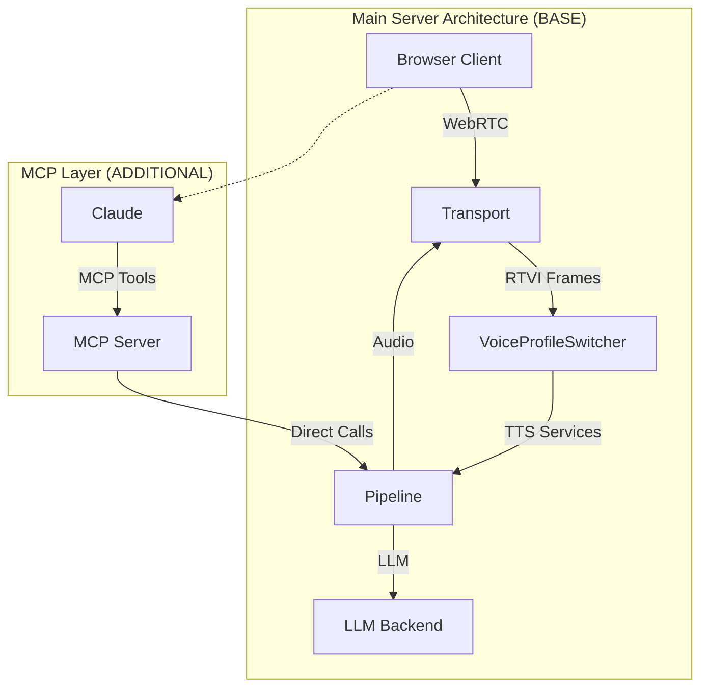
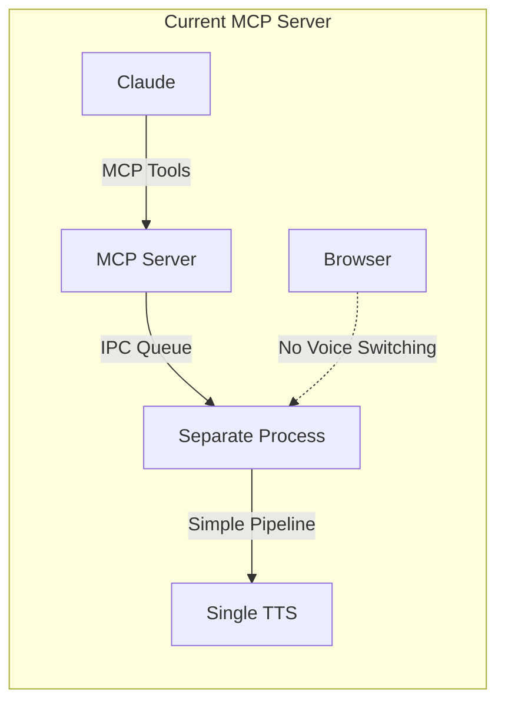
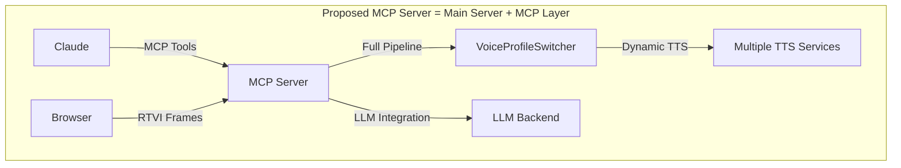
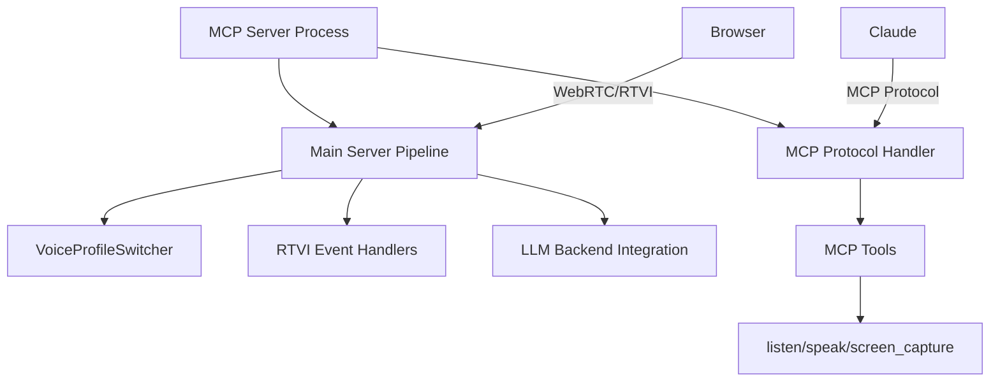
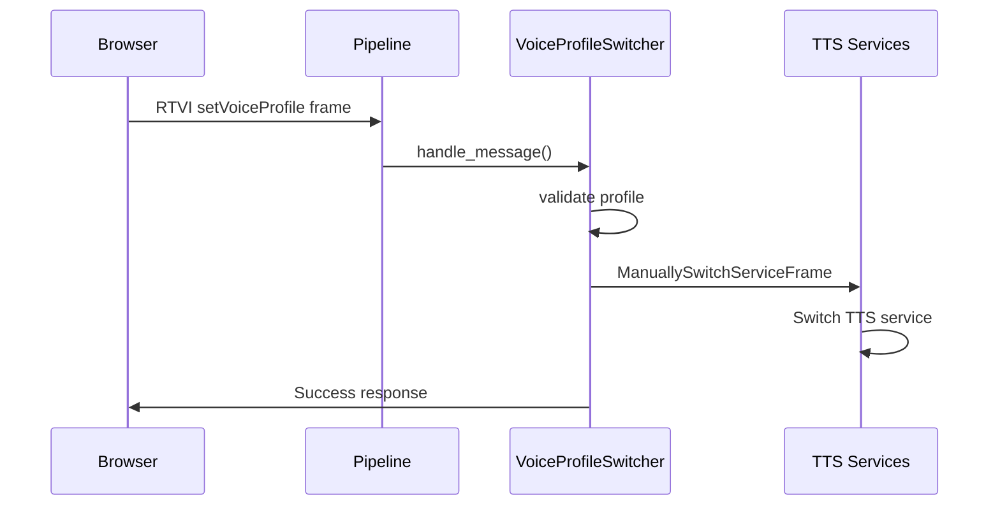
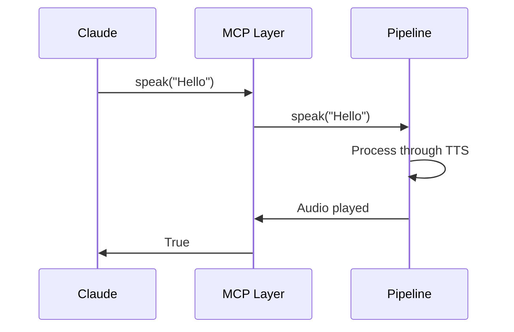

# MCP Server as Main Server + MCP Layer

## Architecture Overview

The MCP server should be IDENTICAL to the main server, but with an additional MCP protocol layer added on top.



## Current vs Proposed Architecture

### Current (Wrong) MCP Server


### Proposed (Correct) MCP Server  


## Technical Design

### 1. Reuse Main Server Code Base

**Files to Copy/Adapt**:
```
server/bot.py              → mcp-server/src/pipecat_mcp_server/bot.py
server/features/voice_switcher.py → mcp-server/src/pipecat_mcp_server/voice_switcher.py
```

### 2. Add MCP Protocol Layer

**New MCP Server Structure**:


### 3. Pipeline Architecture

**Main Server Pipeline** (REUSE):
```python
pipeline = Pipeline([
    transport.input(),
    stt,
    user_aggregator,
    llm,                    # ← ADD THIS
    tts_switcher,          # ← USE THIS (not direct TTS)
    transport.output(),
    assistant_aggregator,
])
```

**MCP Layer Integration**:
```python
# MCP tools call pipeline methods directly
@mcp.tool()
async def listen() -> str:
    """Listen for user speech."""
    # Call into pipeline directly, no IPC
    return await pipeline_agent.listen()

@mcp.tool()
async def speak(text: str) -> bool:
    """Speak text using current TTS service."""
    # Call into pipeline directly, no IPC
    await pipeline_agent.speak(text)
    return True
```

### 4. Voice Switching Integration

**RTVI Event Handlers** (REUSE FROM MAIN):
```python
@task.rtvi.event_handler("on_client_message")
async def handle_client_message(rtvi, msg):
    """Handle voice profile switching from browser."""
    await voice_switcher.handle_message(rtvi, msg)
```

**VoiceProfileSwitcher** (REUSE FROM MAIN):
```python
# Same class, same functionality
voice_switcher = VoiceProfileSwitcher(profile_name, pm, task)
tts_switcher = voice_switcher.get_service_switcher()
```

## Implementation Plan

### Phase 1: Copy Main Server Foundation
```bash
# Copy main server files to MCP server
cp server/bot.py mcp-server/src/pipecat_mcp_server/main_bot.py
cp server/features/voice_switcher.py mcp-server/src/pipecat_mcp_server/
```

### Phase 2: Add MCP Protocol Layer
```python
# New file: mcp-server/src/pipecat_mcp_server/mcp_layer.py
from fastmcp import FastMCP

mcp = FastMCP(name="talky-mcp")

@mcp.tool()
async def listen() -> str:
    """MCP tool for speech recognition."""
    return await main_agent.listen()

@mcp.tool()
async def speak(text: str) -> bool:
    """MCP tool for text-to-speech."""
    await main_agent.speak(text)
    return True

# ... other MCP tools
```

### Phase 3: Integrate Both Layers
```python
# New file: mcp-server/src/pipecat_mcp_server/server.py
def main():
    # Start main server pipeline
    main_agent = create_main_server_agent()
    
    # Start MCP protocol layer
    mcp.run(transport="streamable-http")
```

## Detailed Component Mapping

### Main Server Components → MCP Server

| Main Server | MCP Server | Notes |
|-------------|------------|-------|
| `server/bot.py` | `mcp-server/bot.py` | Full pipeline with LLM |
| `server/features/voice_switcher.py` | Same file | Reuse exactly |
| RTVI Event Handlers | Same handlers | Reuse exactly |
| WebRTC Transport | Same transport | Reuse exactly |
| LLM Integration | Same integration | Reuse exactly |
| VoiceProfileSwitcher | Same switcher | Reuse exactly |

### MCP Layer Components

| Component | Purpose | Implementation |
|-----------|---------|----------------|
| MCP Protocol Handler | Expose tools to Claude | FastMCP server |
| MCP Tools | Claude interface | Direct method calls |
| Tool-to-Pipeline Bridge | Connect MCP to pipeline | Method wrappers |

## Data Flow

### Voice Switching Flow (Browser → Pipeline)


### MCP Tool Flow (Claude → Pipeline)


## File Structure

```
mcp-server/src/pipecat_mcp_server/
├── server.py              # Main entry point
├── mcp_layer.py           # MCP protocol handler
├── bot.py                 # Main server pipeline (copied)
├── voice_switcher.py      # Voice switching (copied)
├── agent.py               # Agent class (simplified)
└── config.py              # Configuration
```

## Key Differences from Current MCP Server

| Aspect | Current | Proposed |
|--------|---------|----------|
| Architecture | IPC + Separate Process | Single Process |
| Pipeline | Simple STT→TTS | Full STT→LLM→TTS |
| Voice Switching | None | Full VoiceProfileSwitcher |
| LLM Integration | None | Same as main server |
| Code Reuse | Minimal | Maximum reuse |
| Complexity | High (IPC) | Low (direct calls) |

## Benefits

1. **Maximum Code Reuse**: Use proven main server code
2. **Full Voice Switching**: Same as main server
3. **LLM Integration**: Same as main server  
4. **Simplified Architecture**: No IPC complexity
5. **Proven Foundation**: Main server already works
6. **Protocol Separation**: Clean MCP layer on top

## Implementation Priority

1. **Copy main server foundation** (highest priority)
2. **Add MCP protocol layer** (medium priority)
3. **Integration testing** (high priority)
4. **Remove old IPC code** (low priority)

## Conclusion

The MCP server should be the main server with an additional MCP protocol layer. This provides maximum code reuse, proven functionality, and clean architecture.
