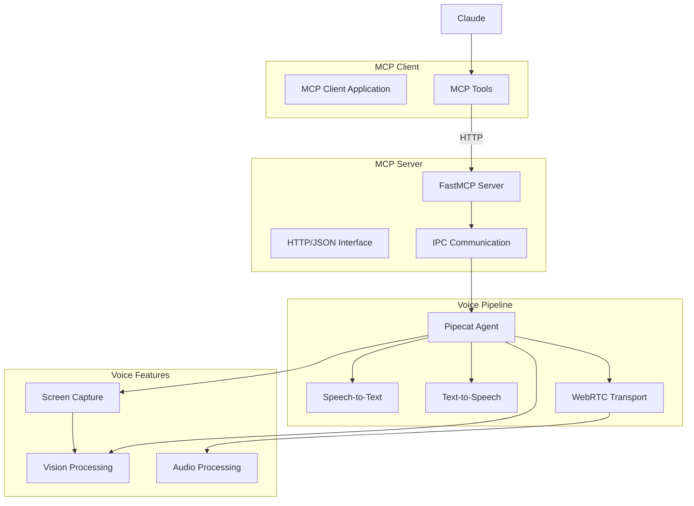
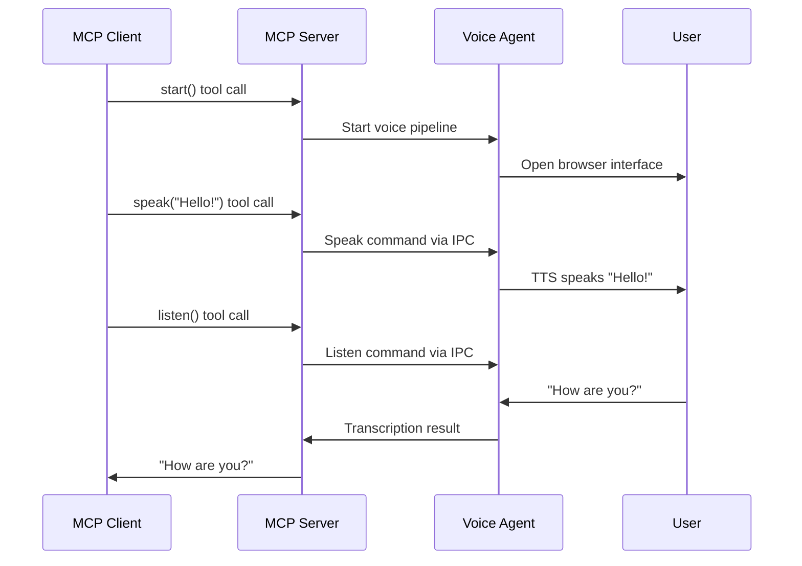

# MCP Integration

## Overview

The MCP (Model Context Protocol) integration exposes voice I/O capabilities as MCP tools, enabling any MCP client to have voice conversations with users through a Pipecat pipeline. This is not an LLM backend integration, but rather a voice interface that MCP clients can use.

## Architecture

### System Architecture



### Protocol Flow
MCP uses a tool-based protocol pattern:
1. **Tool registration** - Voice capabilities exposed as MCP tools
2. **HTTP communication** - JSON over HTTP between client and server
3. **IPC coordination** - Server coordinates with voice agent process
4. **Real-time audio** - WebRTC transport for voice I/O

## Configuration

### MCP Server Setup
```bash
cd mcp-server && uv tool install -e .
pipecat-mcp-server  # runs on localhost:9090
```

### MCP Client Configuration
Configuration varies by MCP client. Example for HTTP-based clients:
```json
{
  "mcpServers": {
    "pipecat": {
      "command": "npx",
      "args": ["-y", "@pyroprompts/mcp-stdio-to-streamable-http-adapter"],
      "env": { "URI": "http://localhost:9090/mcp" }
    }
  }
}
```

Run `pipecat-mcp-server` first, then restart your MCP client application.

### Environment Variables
- `MCP_SERVER_HOST`: Override server host (default: localhost)
- `MCP_SERVER_PORT`: Override server port (default: 9090)
- `PIPECAT_LOG_LEVEL`: Logging level for voice pipeline

## Implementation Details

### Tool Flow



### Available Tools

#### Voice I/O Tools
- **`start()`**: Initialize and start the voice agent
- **`stop()`**: Gracefully shut down the voice pipeline
- **`speak(text)`**: Speak text to the user via TTS
- **`listen()`**: Wait for user speech and return transcription

#### Vision Tools
- **`list_windows()`**: List available windows for capture
- **`screen_capture(window_id)`**: Start/switch screen capture
- **`capture_screenshot()`**: Capture single screenshot

### Key Components

#### MCP Server (`server.py`)
- **FastMCP framework**: HTTP-based MCP server
- **Tool registration**: Exposes voice capabilities as MCP tools
- **IPC coordination**: Manages voice agent process lifecycle

#### Voice Agent (`agent.py`)
- **Pipecat pipeline**: STT + TTS + WebRTC transport
- **IPC communication**: Receives commands from MCP server
- **Audio processing**: VAD, noise filtering, smart turn detection

#### IPC Layer (`agent_ipc.py`)
- **Process management**: Spawns and manages voice agent process
- **Command passing**: JSON-based command communication
- **Result handling**: Returns results to MCP server

## MCP Protocol

### Tool Call Format
```json
{
  "method": "tools/call",
  "params": {
    "name": "speak",
    "arguments": {
      "text": "Hello from Claude!"
    }
  }
}
```

### Tool Response Format
```json
{
  "result": {
    "content": [
      {
        "type": "text",
        "text": "Speech completed successfully"
      }
    ]
  }
}
```

### IPC Command Format
```json
{
  "command": "speak",
  "text": "Hello from Claude!"
}
```

### IPC Response Format
```json
{
  "status": "success",
  "result": {
    "spoken": true
  }
}
```

## Voice Pipeline Features

### Audio Processing
- **VAD (Voice Activity Detection)**: Silero-based speech detection
- **Noise filtering**: RNNoise for background noise reduction
- **Smart turn detection**: LocalSmartTurnAnalyzerV3 for conversation flow
- **Audio transport**: WebRTC for real-time audio streaming

### Vision Capabilities
- **Screen capture**: Real-time window or full-screen capture
- **Window enumeration**: List and select specific application windows
- **Screenshot capture**: Single-frame image capture
- **Vision processing**: Image analysis for visual context

### Transport Options
- **WebRTC**: Browser-based audio/video transport
- **Daily.co**: Cloud WebRTC service
- **Twilio**: Telephony-based transport
- **WebSocket**: Custom WebSocket transport

## Usage Patterns

### Basic Voice Conversation
```python
# In any MCP client
start()                    # Initialize voice system
speak("Hello! I'm ready.")  # Greet user
result = listen()           # Wait for user input
speak(f"You said: {result}")  # Respond to user
```

### Vision-Aware Interaction
```python
windows = list_windows()    # Get available windows
screen_capture(windows[0]["window_id"])  # Capture specific window
screenshot = capture_screenshot()  # Get single frame
# Analyze screenshot content...
```

### Continuous Conversation Loop
```python
start()
while True:
    user_input = listen()
    if user_input.lower() in ["goodbye", "exit"]:
        speak("Goodbye!")
        break
    # Process user_input and generate response
    speak(response)
```

## Performance Considerations

### Resource Usage
- **Memory**: Separate process for voice agent (~100-200MB)
- **CPU**: Audio processing and VAD analysis
- **Network**: WebRTC audio streams + HTTP MCP traffic
- **Browser**: Requires open browser tab for WebRTC

### Latency Characteristics
- **STT latency**: 200-500ms for speech transcription
- **TTS latency**: 100-300ms for speech synthesis
- **Tool call overhead**: 50-100ms for MCP communication
- **Round-trip**: ~500-1000ms total voice interaction

### Concurrent Usage
- **Single voice session**: One active conversation at a time
- **Multiple MCP clients**: Can serve multiple Claude instances
- **Resource isolation**: Voice process isolated from MCP server

## Troubleshooting

### Common Issues

#### Server Won't Start
**Symptom**: "Address already in use" errors
**Cause**: Port 9090 already occupied
**Fix**: Kill existing process or change port

#### Voice Agent Not Responding
**Symptom**: Tool calls hang or timeout
**Cause**: Voice agent process crashed
**Fix**: Check agent logs and restart MCP server

#### Browser Connection Issues
**Symptom**: "Failed to connect to WebRTC"
**Cause**: Browser permissions or firewall issues
**Fix**: Allow microphone/camera permissions

#### Audio Quality Problems
**Symptom**: Poor transcription or TTS quality
**Cause**: Background noise or poor microphone
**Fix**: Use headphones, reduce background noise

### Debug Logging
Enable debug logging for troubleshooting:
```bash
PIPECAT_LOG_LEVEL=DEBUG pipecat-mcp-server
```

Monitor logs for:
- IPC communication between server and agent
- WebRTC connection status
- Audio processing metrics
- Tool call execution

## Development Notes

### Testing Strategy
- Test with various MCP clients
- Verify audio quality in different environments
- Test screen capture with various applications
- Monitor resource usage during extended sessions

### Architecture Benefits
- **Process isolation**: Voice crashes don't affect MCP server
- **Protocol standardization**: Works with any MCP client
- **Extensibility**: Easy to add new voice and vision tools
- **Cross-platform**: Works on macOS, Linux, Windows

### Future Enhancements
- **Multi-language support**: Additional STT/TTS languages
- **Audio file processing**: Upload and process audio files
- **Advanced vision**: Object detection and OCR
- **Custom transports**: Additional audio/video transports

## Comparison with Other Integrations

| Feature | MCP | Pi | Moltis | OpenClaw |
|---------|-----|----|--------|----------|
| Type | Voice Interface | LLM Backend | LLM Backend | LLM Backend |
| Protocol | MCP Tools | RPC Subprocess | WebSocket | WebSocket |
| Primary Use | Voice I/O for AI | AI Processing | AI Processing | AI Processing |
| Setup Complexity | Low | Medium | Low | High |
| Resource Usage | Medium | High | Low | Medium |
| Extensibility | High | Medium | Medium | Low |

## References

- [MCP Protocol Specification](https://modelcontextprotocol.io)
- [Pipecat Framework](https://github.com/pipecat-ai/pipecat)
- [FastMCP Server](https://github.com/jlowin/fastmcp)
