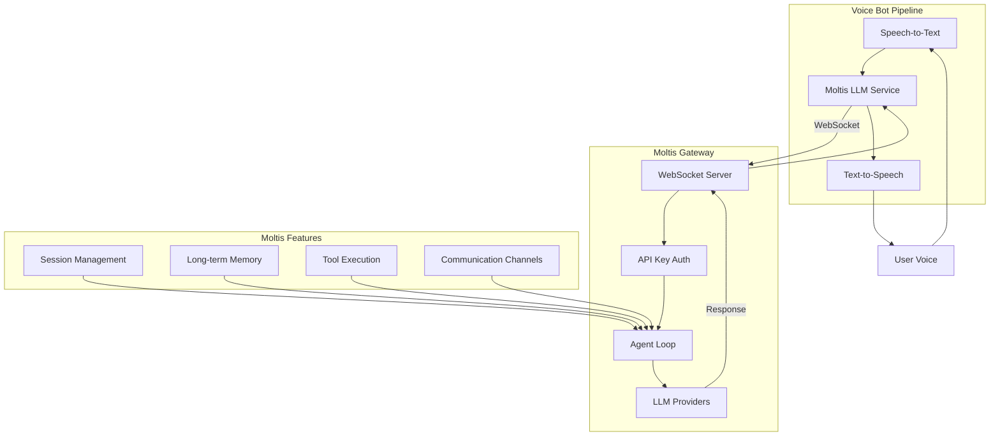
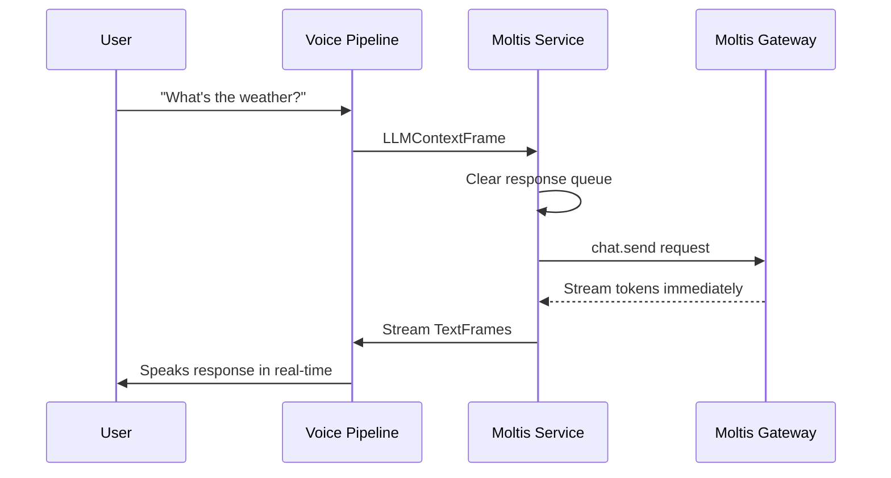

# Moltis Integration

## Overview

Moltis is a personal AI gateway written in Rust that provides multi-provider LLM support through a WebSocket-based API. This integration allows the voice bot to leverage Moltis's streaming AI capabilities while maintaining real-time voice interaction.

## Architecture

### System Architecture



### Protocol Flow
Moltis uses a direct streaming response pattern:
1. **WebSocket connection** with API key authentication
2. **Direct streaming responses** - No two-phase acknowledgment
3. **Session-based persistence** - Maintains conversation history
4. **Real-time token streaming** - Immediate response delivery

## Configuration

### Profile Configuration
```yaml
llm_backends:
  moltis:
    description: "Moltis LLM"
    service_class: "backends.moltis.MoltisLLMService"
    config:
      gateway_url: "wss://localhost:65491/ws"
      api_key: "your-api-key"
      session_strategy: "persistent"
      agent_id: "main"
    system_message: "You are a helpful voice assistant."
```

### Environment Variables
- `MOLTIS_GATEWAY_URL`: Override default WebSocket URL
- `MOLTIS_API_KEY`: API key for authentication

### Session Strategies
- **persistent**: `agent:{agent_id}:voice` - Same session across restarts
- **per-connection**: `agent:{agent_id}:voice-{timestamp}` - New session per connection
- **daily**: `agent:{agent_id}:voice-{YYYY-MM-DD}` - Daily session rotation
- **new**: Always generate new session key

## Implementation Details

### Request Flow



### Key Methods

#### Connection & Authentication
- `_connect()`: Establishes WebSocket connection with SSL context
- `_generate_session_key()`: Creates session key based on strategy
- API key authentication via WebSocket headers

#### Message Handling
- `_handle_messages()`: Processes incoming WebSocket messages
- `_process_context()`: Handles LLM context frames and sends requests
- `process_frame()`: Routes frames including interruption support

#### Response Processing
- **Streaming responses**: Direct token streaming to pipeline
- **Session management**: Maintains conversation context
- **Error handling**: Graceful degradation on connection issues

## WebSocket API

### Connection Request
```json
{
  "type": "connect",
  "id": "12345",
  "params": {
    "sessionKey": "agent:main:voice",
    "features": ["streaming"],
    "policy": {}
  }
}
```

### Chat Send Request
```json
{
  "type": "method",
  "id": "12346", 
  "method": "chat.send",
  "params": {
    "sessionKey": "agent:main:voice",
    "message": "User message here",
    "stream": true
  }
}
```

### Streaming Response
```json
{
  "type": "event",
  "event": "stream",
  "payload": {
    "delta": "partial response text"
  }
}
```

### Final Response
```json
{
  "type": "event",
  "event": "done",
  "payload": {
    "final": true
  }
}
```

## Performance Considerations

### Memory Management
- **Response queue**: Cleared between requests to prevent cross-talk
- **Message handler**: Runs in background task with proper cleanup
- **Session persistence**: SQLite-backed conversation history

### Latency
- **Direct streaming**: No acknowledgment delay like OpenClaw
- **Token-by-token delivery**: Immediate response start
- **WebSocket ping**: Connection health monitoring

### Throughput
- **Parallel tool execution**: Multiple tools can run concurrently
- **Streaming tokens**: Real-time response delivery
- **Session caching**: Reduces repeated setup overhead

## Troubleshooting

### Common Issues

#### Connection Failed
**Symptom**: "Failed to connect to Moltis" errors
**Cause**: Wrong gateway URL, SSL issues, or API key problems
**Fix**: Verify Moltis is running and check configuration

#### Session Issues
**Symptom**: Conversation context not maintained
**Cause**: Session strategy mismatch or session key conflicts
**Fix**: Check session_strategy configuration

#### Streaming Problems
**Symptom**: Responses arrive all at once instead of streaming
**Cause**: Stream parameter not set or network buffering
**Fix**: Ensure `stream: true` in request parameters

#### Authentication Errors
**Symptom**: 401 Unauthorized responses
**Cause**: Missing or invalid API key
**Fix**: Set MOLTIS_API_KEY environment variable

### Debug Logging
Enable debug logging to trace request/response flow:
```python
logger.info(f"📤 Sending to Moltis: {json.dumps(request_data)}")
logger.info(f"🤖 Response: {response[:100]}...")
```

## Comparison with Other Integrations

| Feature | Moltis | OpenClaw | Pi |
|---------|--------|----------|----|
| Language | Rust | Node.js | Python |
| Protocol | WebSocket + streaming | WebSocket + two-phase | WebSocket |
| Response Pattern | Direct streaming | Empty res + chat event | Direct |
| Latency | Very low (streaming) | Medium (two-phase) | Medium |
| Session Management | SQLite persistence | Session-based | Request-based |
| Tool Execution | Parallel | Sequential | Sequential |
| Memory Usage | Low (Rust) | Medium (Node.js) | High (Python) |

## Development Notes

### Testing Strategy
- Test with Moltis gateway running on default port 65491
- Verify API key authentication works
- Test different session strategies
- Monitor streaming performance during extended sessions

### Future Enhancements
- **Session switching**: Dynamic session key changes
- **Tool result filtering**: Better handling of large tool outputs
- **Memory integration**: Leverage Moltis long-term memory
- **Channel integration**: Use Moltis communication channels

## References

- [Moltis Documentation](https://moltis.org)
- [Moltis GitHub](https://github.com/moltis-org/moltis)
- [Moltis Protocol](https://github.com/moltis-org/moltis-protocol)
- [Pipecat LLM Service Base Class](https://github.com/pipecat-ai/pipecat)
