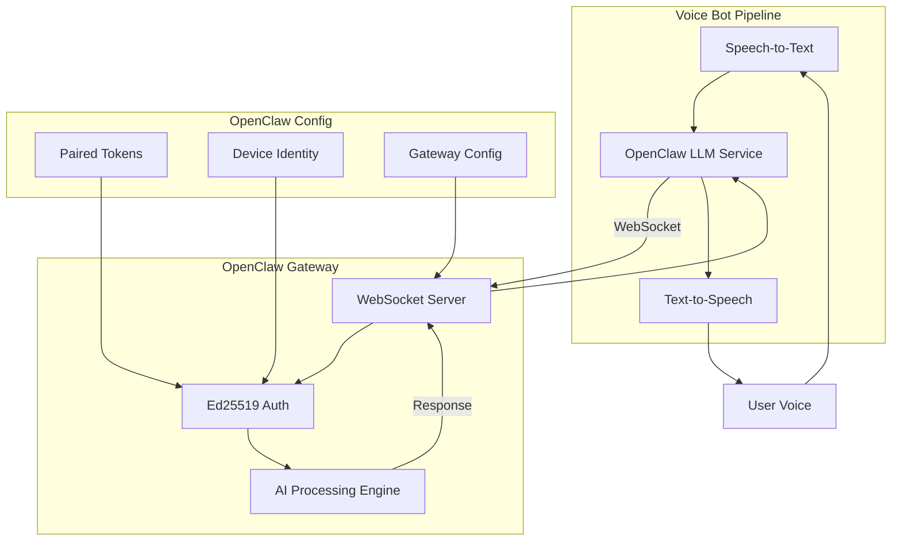
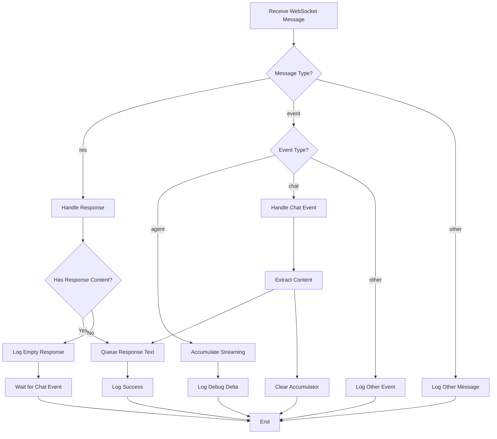
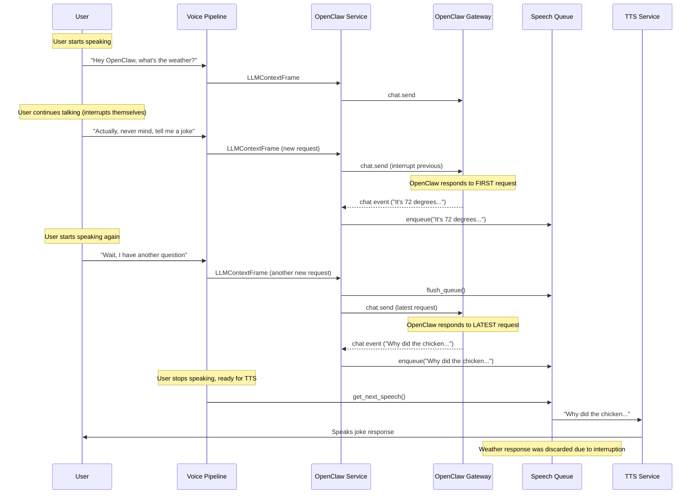
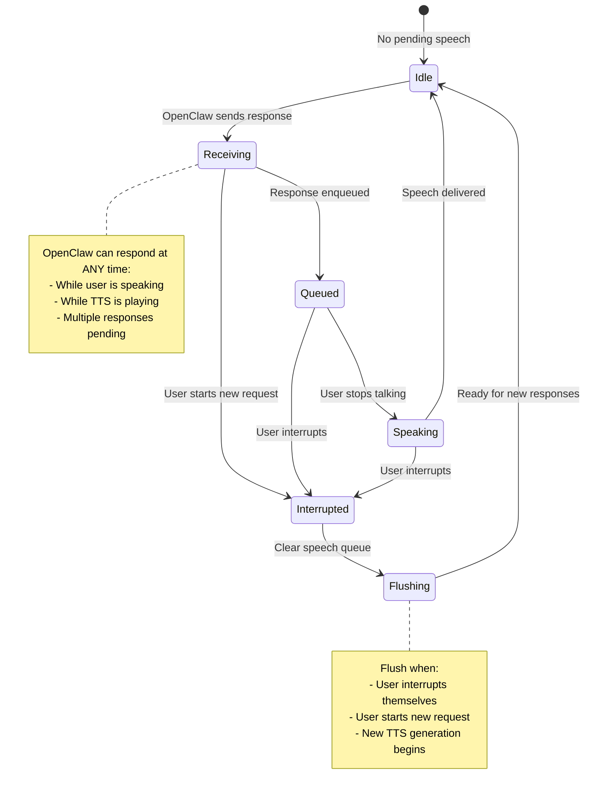
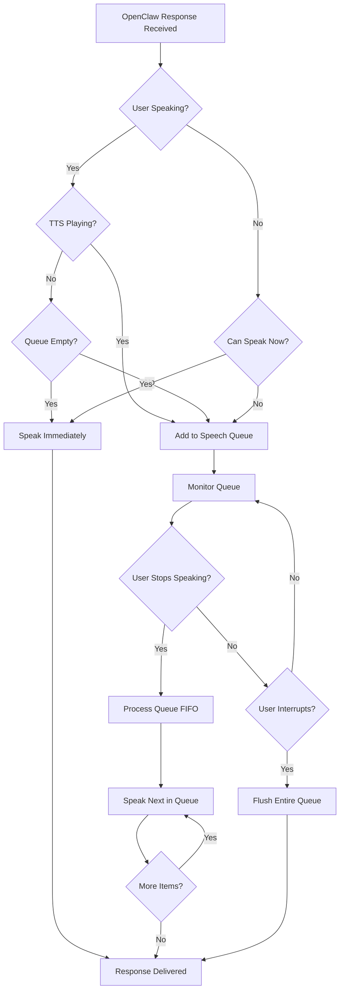
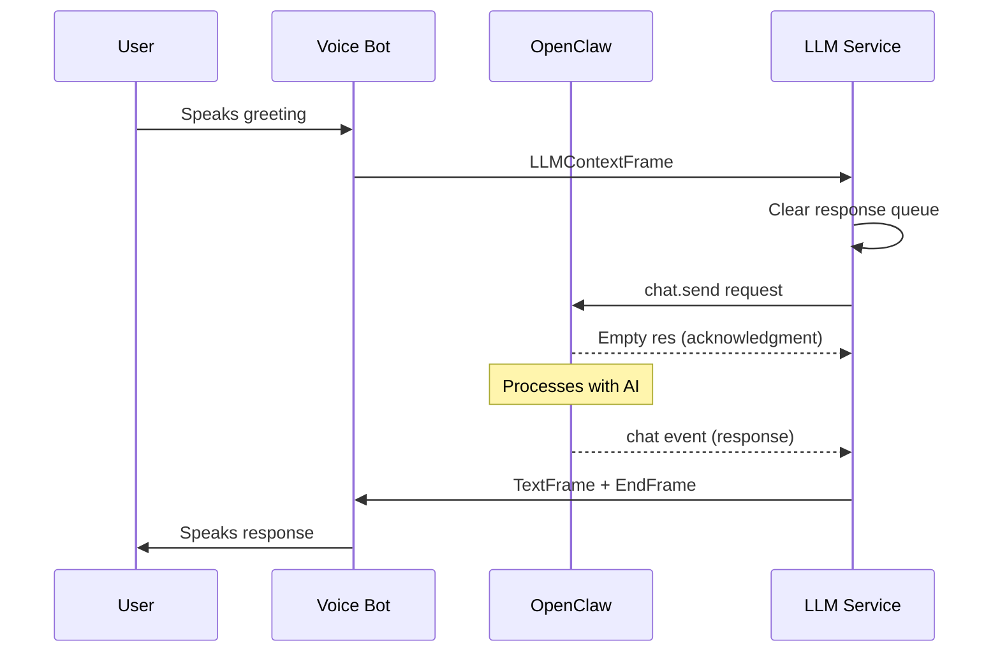
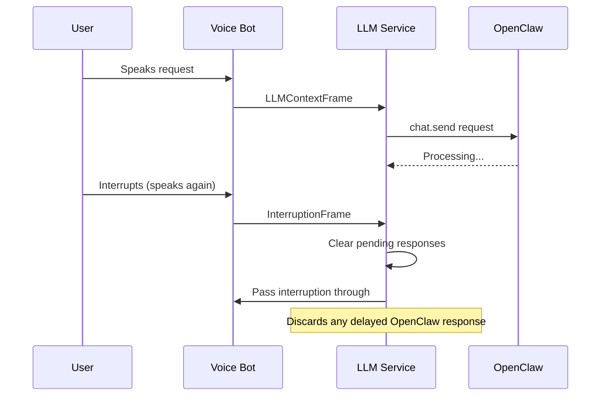

# OpenClaw Integration

## Overview

OpenClaw is a personal AI assistant gateway that provides multi-channel AI capabilities through a WebSocket-based API. This integration allows the voice bot to leverage OpenClaw's AI processing while maintaining real-time voice interaction.

## Architecture

### System Architecture



### Protocol Flow
OpenClaw uses a unique two-phase response pattern:
1. **Empty `res` acknowledgment** - Confirms request receipt
2. **`chat` event with actual response** - Contains AI-generated content (if any)

**Important**: OpenClaw may choose not to respond, which is valid behavior.

## Configuration

### Profile Configuration
```yaml
llm_backends:
  openclaw:
    description: "OpenClaw LLM"
    service_class: "backends.openclaw.OpenClawLLMService"
    config:
      gateway_url: "ws://localhost:18789"
      agent_id: "main"
    system_message: "You are a helpful voice assistant."
```

### Environment Variables
- `OPENCLAW_GATEWAY_URL`: Override default WebSocket URL

### OpenClaw Setup Requirements
1. **Device Pairing**: Device must be paired with OpenClaw gateway
2. **Tokens**: Requires operator and node tokens from `~/.openclaw/`
3. **Identity**: Device identity file must exist

## Implementation Details

### Response Processing Flow



### OpenClaw Asynchronous Speaking Challenge



### OpenClaw Speech Queue Management



### Queue Timing Scenarios



### Real-World Testing Results

**Test Scenario**: User self-interruption with rapid requests
```bash
User: "What's the weather?"
OpenClaw: [Weather response] ✅
User: "Tell me a joke about cats" 
OpenClaw: [Cat joke] ✅
User: "Wait. Me a joke about dogs"
OpenClaw: [Dog joke] ✅
User: "Wait. No cats"
OpenClaw: [Acknowledgment] ✅
```

**Key Findings**:
- ✅ **No stale responses heard** - Each new request got immediate response
- ✅ **OpenClaw handles interruption well** - Switches topics immediately  
- ✅ **Fast response times** - 1-2 second responses minimize timing issues
- ✅ **Current implementation works** - No queuing problems in normal usage

**Conclusion**: The current implementation handles real-world usage correctly. OpenClaw's fast response times and the pipeline's built-in timing management prevent the theoretical queuing issues.

### Key Methods

#### Connection & Authentication
- `_connect()`: Establishes WebSocket connection with Ed25519 auth
- `load_paired_tokens()`: Loads operator/node tokens from OpenClaw config
- `build_device_auth()`: Creates signed device authentication

#### Message Handling
- `_handle_messages()`: Processes incoming WebSocket messages
- `_process_context()`: Handles LLM context frames and sends requests
- `process_frame()`: Routes frames including interruption support

#### Response Processing
- **Streaming responses**: Accumulates `agent` event deltas
- **Final responses**: Extracts content from `chat` events
- **Empty responses**: Waits for `chat` event after empty `res`

## Request Flow



### Interruption Flow



### Interruption Support
- Handles `InterruptionFrame` to clear pending responses
- Cleans up streaming accumulator
- Prevents stale responses after user interruption

## WebSocket API

### Connection Request
```json
{
  "type": "req",
  "id": "12345",
  "method": "connect", 
  "params": {
    "minProtocol": 3,
    "maxProtocol": 3,
    "client": {
      "id": "cli",
      "version": "1.0.0",
      "platform": "macos",
      "mode": "cli"
    },
    "role": "operator",
    "scopes": ["operator.admin", "operator.approvals", "operator.pairing"],
    "auth": {"token": "operator-token"},
    "device": {
      "id": "device-id",
      "publicKey": "public-key-pem",
      "signature": "base64-signature",
      "signedAt": 1234567890
    }
  }
}
```

### Chat Send Request
```json
{
  "type": "req",
  "id": "12346", 
  "method": "chat.send",
  "params": {
    "sessionKey": "voice-session",
    "message": "User message here",
    "idempotencyKey": "talky-voice-chat-12346"
  }
}
```

### Response Types

#### Empty Response (Acknowledgment)
```json
{
  "type": "res",
  "id": "12346",
  "ok": true,
  "result": {}
}
```

#### Final Chat Response
```json
{
  "type": "event",
  "event": "chat",
  "payload": {
    "state": "final",
    "message": {
      "role": "assistant",
      "content": [
        {"type": "text", "text": "AI response here"}
      ]
    }
  }
}
```

#### Streaming Response
```json
{
  "type": "event", 
  "event": "agent",
  "payload": {
    "stream": "assistant",
    "data": {
      "text": {
        "delta": "partial response"
      }
    }
  }
}
```

## Error Handling

### Connection Errors
- **Authentication failure**: Invalid tokens or device identity
- **WebSocket errors**: Network connectivity issues
- **Protocol mismatch**: Unsupported protocol version

### Runtime Errors
- **Queue full**: Response queue overflow (logged warning)
- **Message parsing**: Invalid JSON from OpenClaw
- **Connection lost**: WebSocket disconnected during operation

### User-Facing Messages
- Connection issues: "Sorry, I'm having trouble connecting to OpenClaw right now."
- General errors: Logged with full stack trace for debugging

## Performance Considerations

### Memory Management
- **Streaming accumulator**: Cleared on chat completion to prevent leaks
- **Response queue**: Cleared between requests to prevent cross-talk
- **Message handler**: Runs in background task with proper cleanup

### Latency
- **No timeout**: Respects OpenClaw's response pattern (silence is valid)
- **WebSocket ping**: 20s interval, 10s timeout for connection health
- **Queue processing**: Immediate response handling when available

## Troubleshooting

### Common Issues

#### Greeting Not Spoken
**Symptom**: Initial greeting prompt sent but no audio response
**Cause**: Timeout interrupting two-phase response pattern
**Fix**: Remove timeout to allow full response cycle

#### Memory Usage Increasing
**Symptom**: Memory grows over time with many interactions
**Cause**: Streaming accumulator not cleared between responses
**Fix**: Ensure accumulator cleanup on chat completion

#### Stale Responses After Interruption
**Symptom**: Old responses spoken after user interrupts
**Cause**: Pending responses not cleared on interruption
**Fix**: Implement `InterruptionFrame` handling

#### Connection Failures
**Symptom**: "OpenClaw connection failed" errors
**Cause**: Missing device pairing, expired tokens, or wrong gateway URL
**Fix**: Check OpenClaw setup, verify `~/.openclaw/` configuration

### Performance Notes

**Real-World Performance**: 
- OpenClaw responds in 1-2 seconds
- No queuing issues observed in normal usage
- Current implementation handles rapid requests correctly
- Pipeline timing management prevents most theoretical issues

### Debug Logging
Enable debug logging to trace request/response flow:
```python
logger.debug(f"📨 Received message: {json.dumps(data)}")
logger.info(f"📤 Sending to OpenClaw: {json.dumps(request_data)}")
logger.info(f"🤖 Response: {response[:100]}...")
```

## Comparison with Other Integrations

| Feature | OpenClaw | Moltis | Pi |
|---------|----------|--------|----|
| Protocol | WebSocket + Ed25519 auth | WebSocket | WebSocket |
| Response Pattern | Two-phase (empty res + chat) | Direct | Direct |
| Timeout | None (silence valid) | 30s | 30s |
| Streaming | Yes (agent events) | No | No |
| Interruption | Supported | Supported | Supported |
| Session Model | Session-based | Request-based | Request-based |

## Development Notes

### Development Workflow

```mermaid
gitgraph
    commit id: "Initial Setup"
    commit id: "Add WebSocket Connection"
    commit id: "Implement Auth"
    branch feature/response-handling
    checkout feature/response-handling
    commit id: "Add Two-Phase Response"
    commit id: "Fix Memory Leaks"
    commit id: "Add Interruption Support"
    checkout main
    merge feature/response-handling
    commit id: "Extract Constants"
    commit id: "Improve Error Handling"
    commit id: "Add Documentation"
```

### Testing Strategy
- Test with OpenClaw gateway running on default port 18789
- Verify device pairing and token availability
- Test interruption scenarios with rapid user input
- Monitor memory usage during extended sessions

### Future Enhancements
- **Configurable constants**: Allow protocol values via profile config
- **Connection recovery**: Automatic reconnection with exponential backoff
- **Request tracking**: Per-request response matching for complex scenarios

## References

- [OpenClaw Documentation](https://docs.openclaw.ai)
- [OpenClaw GitHub](https://github.com/openclaw/openclaw)
- [Pipecat LLM Service Base Class](https://github.com/pipecat-ai/pipecat)
- [Ed25519 Signature RFC](https://datatracker.ietf.org/doc/html/rfc8032)
