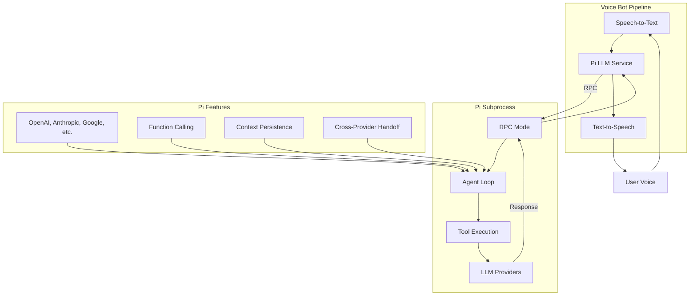
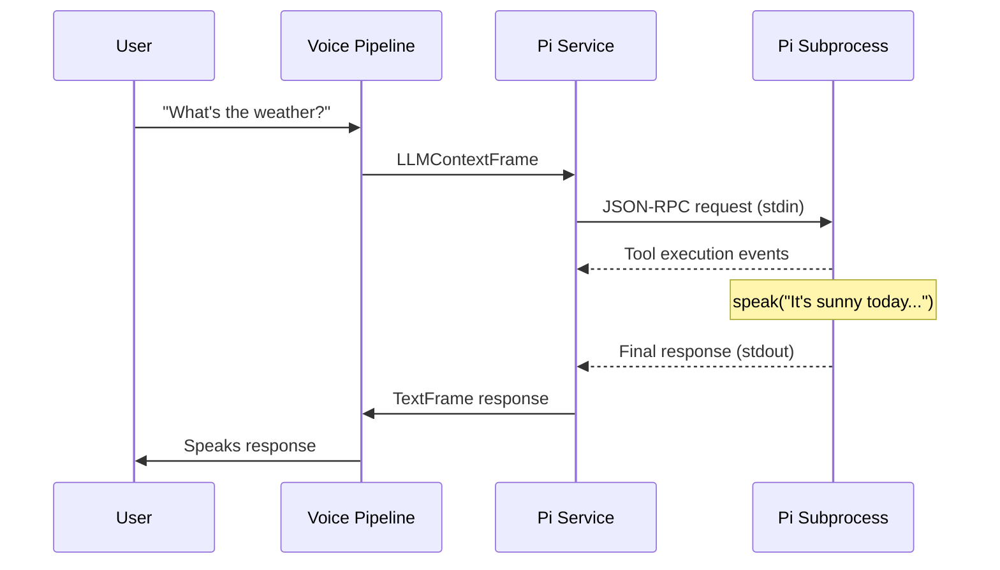

# Pi Integration

## Overview

Pi is a unified multi-provider LLM agent system with tool calling capabilities. This integration uses Pi's RPC mode to spawn a subprocess that handles AI processing while maintaining real-time voice interaction through the Pipecat pipeline.

## Architecture

### System Architecture



### Protocol Flow
Pi uses a subprocess RPC communication pattern:
1. **Subprocess spawning** - Pi runs in `--mode rpc` as separate process
2. **JSON-RPC communication** - stdin/stdout JSON message exchange
3. **Tool execution events** - Real-time tool call notifications
4. **Direct responses** - No complex acknowledgment patterns

## Configuration

### Profile Configuration
```yaml
llm_backends:
  pi:
    description: "Pi LLM"
    service_class: "backends.pi.PiLLMService"
    config:
      pi_binary: "pi"
      working_dir: "."
    system_message: "You are a helpful voice assistant."
```

### Environment Variables
- `PI_WORKING_DIR`: Override default working directory
- `PI_BINARY_PATH`: Override pi binary location

### Pi Setup Requirements
1. **Pi installation**: Must have `pi` binary available in PATH
2. **Provider configuration**: At least one LLM provider configured
3. **Working directory**: Directory with pi configuration files
4. **API keys**: Environment variables for chosen providers

## Implementation Details

### Request Flow



### Key Methods

#### Process Management
- `_start_pi()`: Spawns pi subprocess in RPC mode
- `_handle_stdout()`: Parses JSON lines from subprocess stdout
- `_handle_pi_event()`: Processes different event types from pi

#### Message Handling
- `process_frame()`: Routes frames including interruption support
- `_process_context()`: Handles LLM context frames and sends to pi
- `push_frame()`: Sends frames to Pipecat pipeline

#### Response Processing
- **Tool execution events**: Real-time notifications of tool calls
- **Speak tool integration**: Direct TTS integration points
- **Error handling**: Subprocess crash recovery

## RPC Protocol

### Request Format (stdin)
```json
{
  "type": "request",
  "id": "12345",
  "method": "chat",
  "params": {
    "context": {
      "systemPrompt": "You are a helpful assistant.",
      "messages": [
        {"role": "user", "content": "User message here"}
      ]
    }
  }
}
```

### Tool Execution Event (stdout)
```json
{
  "type": "tool_execution_start",
  "toolName": "speak",
  "args": {
    "text": "Response text here"
  }
}
```

### Response Format (stdout)
```json
{
  "type": "response",
  "id": "12345",
  "result": {
    "content": "Final response content"
  }
}
```

## Performance Considerations

### Process Management
- **Subprocess overhead**: One-time startup cost per session
- **Memory usage**: Separate process memory space
- **Communication latency**: JSON-RPC over stdin/stdout

### Response Characteristics
- **Tool execution visibility**: Real-time tool call notifications
- **Provider flexibility**: Can switch between LLM providers
- **Context persistence**: Maintains conversation state

### Resource Usage
- **CPU**: Separate process for AI processing
- **Memory**: Isolated from main voice bot process
- **Network**: Direct provider connections from subprocess

## Troubleshooting

### Common Issues

#### Pi Binary Not Found
**Symptom**: "Failed to start pi subprocess" errors
**Cause**: Pi binary not in PATH or not installed
**Fix**: Install pi and ensure it's available in PATH

#### Subprocess Crashes
**Symptom**: Sudden disconnection or no response
**Cause**: Pi process crashed or configuration errors
**Fix**: Check pi logs and configuration files

#### Provider Authentication
**Symptom**: API key errors from pi subprocess
**Cause**: Missing or invalid provider credentials
**Fix**: Set required environment variables for LLM providers

#### Working Directory Issues
**Symptom**: Config file not found errors
**Cause**: Incorrect working directory or missing config
**Fix**: Set correct working_dir in profile configuration

### Debug Logging
Enable debug logging to trace subprocess communication:
```python
logger.info(f"🚀 Starting pi subprocess: {self.pi_binary} --mode rpc")
logger.debug(f"📤 Sending to pi: {json.dumps(request_data)}")
logger.debug(f"📨 Received from pi: {json.dumps(data)}")
```

## Pi Features Integration

### Multi-Provider Support
Pi supports numerous LLM providers:
- **OpenAI** - GPT models with tool calling
- **Anthropic** - Claude models
- **Google** - Gemini models
- **Azure OpenAI** - Enterprise OpenAI
- **Groq, Cerebras, xAI** - High-performance providers
- **Custom OpenAI-compatible** - Ollama, vLLM, etc.

### Tool Calling
- **Function calling** - Type-safe tool definitions
- **Real-time events** - Tool execution notifications
- **Speak tool** - Direct TTS integration
- **Custom tools** - Extensible tool system

### Context Management
- **Conversation history** - Automatic context persistence
- **Cross-provider handoff** - Switch models mid-conversation
- **Context serialization** - Transfer between sessions

## Comparison with Other Integrations

| Feature | Pi | Moltis | OpenClaw |
|---------|----|--------|----------|
| Architecture | Subprocess RPC | WebSocket | WebSocket |
| Language | TypeScript/Node.js | Rust | Node.js |
| Provider Support | Multi-provider | Single (configurable) | Single (OpenClaw) |
| Tool Calling | Built-in | Built-in | Limited |
| Response Pattern | Direct with events | Streaming | Two-phase |
| Setup Complexity | Medium | Low | High |
| Resource Usage | High (separate process) | Low (Rust) | Medium (Node.js) |

## Development Notes

### Testing Strategy
- Test with pi binary available in PATH
- Verify provider authentication works
- Test tool execution events
- Monitor subprocess resource usage

### Future Enhancements
- **Process pooling**: Reuse subprocess instances
- **Event filtering**: Selective tool event handling
- **Provider switching**: Dynamic provider changes
- **Context optimization**: Better memory management

## References

- [Pi Documentation](https://shittycodingagent.ai)
- [Pi GitHub](https://github.com/badlogic/pi-mono)
- [Pi AI Package](https://www.npmjs.com/package/@mariozechner/pi-ai)
- [Pipecat LLM Service Base Class](https://github.com/pipecat-ai/pipecat)
