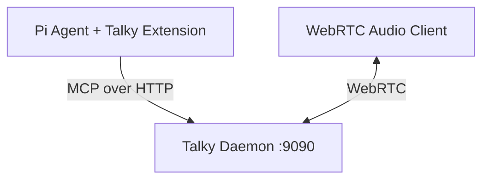

# Pi Integration

## Overview

Pi is a coding agent with an extension system. This integration adds voice conversation capabilities to Pi via a **Pi extension** that connects to the **talky daemon**. Pi is the main application; Talky provides voice I/O as a service.

This is the reverse of most Talky integrations: instead of Talky starting an LLM subprocess, Pi starts Talky and uses it for voice.

## Architecture


```mermaid
graph TB
    Pi[Pi Agent + Talky Extension] -->|MCP over HTTP| Daemon[Talky Daemon :9090]
    Browser[WebRTC Audio Client] <-->|WebRTC| Daemon
```

The talky daemon is a single process on :9090 that embeds the WebRTC handler, serves the browser UI from `client/dist/`, hosts FastMCP tools, and owns the in-process voice pipeline. One port, one process.

**Components:**
- **Pi extension** (`pi-extension/index.ts`) — Registers voice tools, manages MCP client
- **Talky daemon** (`talky daemon`) — Runs the voice pipeline + WebRTC + FastMCP tools
- **Browser** — Connects to the daemon for WebRTC audio I/O (served at `http://localhost:9090`)

**Protocol:** The extension speaks MCP streamable-HTTP (JSON-RPC 2.0 over HTTP POST) to the talky daemon on port 9090. Responses can be JSON or SSE. The `convo_listen()` call is long-polling — it blocks until the user speaks.

## Installation

### Quick test
```bash
pi -e /path/to/talky/pi-extension/index.ts
```

### Permanent (auto-discovered)
```bash
# Symlink into Pi's extension directory
ln -s /path/to/talky/pi-extension ~/.pi/agent/extensions/talky
```

Or add to `~/.pi/agent/settings.json`:
```json
{
  "extensions": ["/path/to/talky/pi-extension/index.ts"]
}
```

### Prerequisites
- `talky` CLI installed and in PATH (runs the talky daemon)
- A browser (for WebRTC audio connection)

## Usage

### Start a voice conversation

**Option 1 — Command:**
```
/voice
```

**Option 2 — Natural language (auto-detected):**
```
I want a voice conversation
let's talk
start voice
```

### What happens
1. Extension checks if the talky daemon is running, starts it if not (`talky daemon`)
2. Calls MCP `start_convo()` to initialize the voice pipeline
3. Opens your browser to `http://localhost:9090` for WebRTC audio
4. Injects voice system prompt so Pi uses speak/listen tools
5. Pi greets you and starts the conversation loop

### Conversation loop
Pi uses three tools in a loop:
- `voice_speak(text)` — Speak to you via TTS
- `voice_listen()` — Wait for your speech, returns transcription
- `voice_stop()` — End the session

The flow matches the Pipecat MCP skill behavior:
- Speak → Listen → (do work) → Speak → Listen → …
- Pi gives voice progress updates during tasks
- Say "goodbye" to end the conversation

### Stop
Say "goodbye" or "stop" during the conversation. Pi will confirm, then call `voice_stop()`.

## Environment Variables

| Variable | Default | Description |
|----------|---------|-------------|
| `TALKY_MCP_PORT` | `9090` | Port for the talky daemon (MCP + WebRTC + browser UI, all one port) |

> Note: pre-5098 there was a separate `TALKY_WEBRTC_PORT` for the legacy pipecat standalone. That port is gone. `pi-extension/index.ts` still has a stale default — tracked in ticket `f9d2`.

## Extension Details

### Registered Tools

| Tool | Description |
|------|-------------|
| `voice_speak(text)` | Speak text via TTS (1-2 sentences) |
| `voice_listen()` | Block until user speaks, return transcription |
| `voice_stop()` | End voice session |

### Registered Command

| Command | Description |
|---------|-------------|
| `/voice` | Start a voice conversation |

### Events Handled

| Event | Behavior |
|-------|----------|
| `input` | Detects natural language voice triggers |
| `before_agent_start` | Injects voice system prompt when voice is active |
| `session_shutdown` | Cleans up voice resources |

### Footer Status
When voice is active, the footer shows:
- 🎤 Voice active
- 👂 Listening…
- 🔊 Speaking…
- ❌ Voice error

## MCP Client Protocol

The extension implements a minimal MCP streamable-HTTP client:

1. **Health check**: `GET /mcp` — any response means server is up
2. **Initialize**: `POST /mcp` with `{"method": "initialize", ...}` → extracts `mcp-session-id` from response header
3. **Initialized notification**: `POST /mcp` with `{"method": "notifications/initialized"}`
4. **Tool calls**: `POST /mcp` with `{"method": "tools/call", "params": {"name": "speak", "arguments": {"text": "..."}}}`

Responses can be `application/json` (simple) or `text/event-stream` (SSE for long-blocking calls like `listen()`). The client handles both.

## Testing

```bash
# Run integration tests (mock MCP server, no audio needed)
npx tsx pi-extension/test.ts
```

Tests verify:
- MCP initialize handshake
- Tool calls (start, speak, listen, stop) with JSON responses
- Tool calls with SSE responses
- Error handling for unknown tools
- Full conversation flow
- Reconnection after disconnect

## Troubleshooting

### Voice never connects
**Symptom:** Browser opens but no audio
**Fix:** Check that `talky daemon` started correctly. Look for errors in the terminal where Pi is running, or tail `~/.talky/run/mcp-daemon.log`.

### Extension not loading
**Symptom:** No `/voice` command available
**Fix:** Ensure the extension path is correct. Try `pi -e /path/to/talky/pi-extension/index.ts` to test.

### listen() times out
**Symptom:** Voice stops working after a long silence
**Fix:** The `listen()` call has a 10-minute timeout. If the user doesn't speak for 10 minutes, the call will fail. Just restart with `/voice`.

## References

- [Pi Extension Docs](https://github.com/badlogic/pi-mono/blob/main/packages/coding-agent/docs/extensions.md)
- [MCP Streamable HTTP Spec](https://modelcontextprotocol.io/specification/2025-03-26/basic/transports#streamable-http)
- [Talky Daemon](../mcp-server/)
