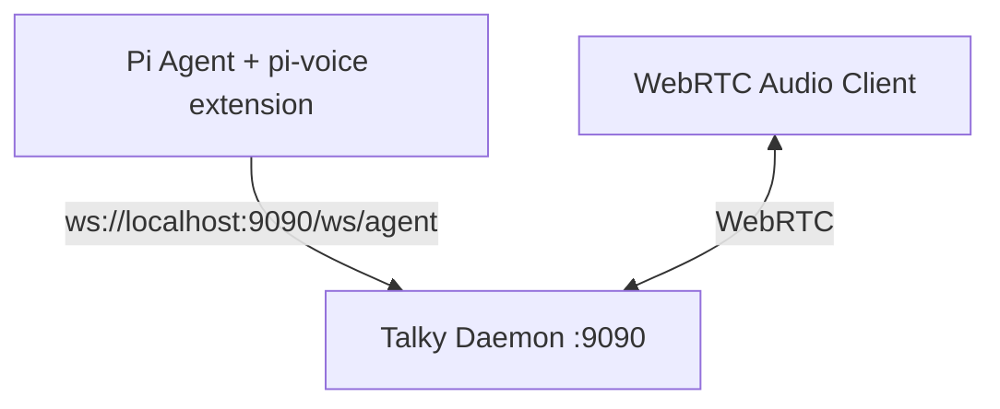

# Pi Integration

## Overview

Pi is a coding agent with an extension system. This integration adds voice conversation capabilities to Pi via a **WebSocket extension** that connects to the **talky daemon**. Pi runs in its own terminal; the talky daemon runs the voice pipeline and serves a browser UI for audio I/O.

## Architecture


```mermaid
graph TB
    Pi[Pi Agent + pi-voice extension] -->|ws://localhost:9090/ws/agent| Daemon[Talky Daemon :9090]
    Browser[WebRTC Audio Client] <-->|WebRTC| Daemon
```

The talky daemon is a single process on `:9090` that embeds the WebRTC handler, serves the browser UI from `client/dist/`, hosts FastMCP tools, and owns the in-process voice pipeline. One port, one process.

**Components:**
- **pi-voice extension** (`extensions/pi-voice/extension.ts`) — Bridges Pi to the daemon over a single WebSocket. Pi events → daemon STT/abort frames; daemon `stt` / `greet` messages → Pi user messages.
- **Talky daemon** (`talky daemon`) — Runs the voice pipeline + WebRTC + the `/ws/agent` endpoint
- **Browser** — Connects to the daemon for WebRTC audio I/O at `http://localhost:9090`

**Protocol:** The extension speaks a minimal JSON-over-WebSocket protocol (see `agent_ext_llm_service.py` docstring). When the user speaks, the daemon sends `{"type":"stt","text":"..."}`; the extension hands that to Pi as a user message. Pi's response token deltas stream back as `{"type":"tts","text":"..."}` frames. On connect the daemon also sends a `{"type":"greet","instruction":"..."}` so the agent speaks first in its own words (ticket 5d95).

## Usage

```bash
talky pi            # Launch Pi with voice, ensures daemon, opens browser
talky pi --cwd ~/x  # Run Pi in a specific working directory
```

`talky pi` is a shortcut for `talky launch pi`, which reads the `launcher:` block from `~/.talky/talky-profiles.yaml`:

```yaml
pi:
  description: "Pi"
  llm_backend: "agent-ext"
  launcher:
    mode: foreground
    command: ["pi"]
    extension_arg: "-e"
    extension: "{project_root}/extensions/pi-voice/extension.ts"
    autoconnect_browser: true
```

### What happens
1. `talky pi` ensures the daemon is running on `:9090`.
2. Opens the browser at `http://localhost:9090/?autoconnect=true` for WebRTC audio.
3. Exec's into `pi -e <project_root>/extensions/pi-voice/extension.ts`.
4. The extension connects to `ws://localhost:9090/ws/agent`. Daemon switches the active LLM to the `agent-ext` backend (so the picker shows "pi").
5. Daemon sends a `greet` instruction. Pi generates its own greeting words and streams them back via TTS.
6. Conversation loop: user speaks → STT → daemon → ws `stt` → Pi user message → Pi generates → ws `tts` deltas → daemon TTS → user hears.

### Stop
Close the Pi terminal (`Ctrl+C` or `/quit`) or close the browser tab. The daemon stays running for the next session.

## Environment Variables

| Variable | Default | Description |
|----------|---------|-------------|
| `TALKY_DAEMON_PORT` | `9090` | Port for the talky daemon (legacy: `TALKY_MCP_PORT`) |
| `TALKY_DAEMON_HOST` | `localhost` | Host for the talky daemon (legacy: `TALKY_MCP_HOST`) |
| `TALKY_AGENT_WS_URL` | `ws://localhost:9090/ws/agent` | Full ws URL the extension dials (overrides host/port) |

## Extension Details

### Wire protocol (excerpt — full spec in `agent_ext_llm_service.py`)

Daemon → extension:
- `{"type":"ready"}` — handshake after accept
- `{"type":"greet","instruction":"..."}` — agent should greet in its own words
- `{"type":"stt","text":"..."}` — user speech transcript
- `{"type":"abort"}` — VAD barge-in, abort current agent turn

Extension → daemon:
- `{"type":"tts_start"}` — agent response starting
- `{"type":"tts","text":"..."}` — response token delta
- `{"type":"tts_end"}` — agent response complete
- `{"type":"tool_start","text":"..."}` / `{"type":"tool_end","text":"..."}` — tool-call breadcrumbs

### Slash command

| Command | Description |
|---------|-------------|
| `/voice` | Show talky voice connection status (info only) |

## Troubleshooting

### Voice never connects
**Symptom:** Browser opens but no audio
**Fix:** Confirm the daemon is up — `curl -s localhost:9090/status`. Read `~/.talky/run/talky-daemon.log` for errors.

### Extension not loading
**Symptom:** Pi runs but the daemon never sees an extension connect
**Fix:** Verify the extension path exists and Pi was launched with `-e` pointing at it. `talky pi` does this automatically.

### Pi greeted but I want it silent
**Fix:** Disable greeting at any layer in YAML by setting `greeting: "__none__"`. Sentinel can live on the talky profile, the LLM backend, or `defaults.greeting` in `settings.yaml`.

## References

- [Pi Extension Docs](https://github.com/badlogic/pi-mono/blob/main/packages/coding-agent/docs/extensions.md)
- [Talky Daemon](../mcp-server/)
- [agent_ext_llm_service.py](../../mcp-server/src/pipecat_mcp_server/agent_ext_llm_service.py)
- [extensions/pi-voice/extension.ts](../../extensions/pi-voice/extension.ts)
